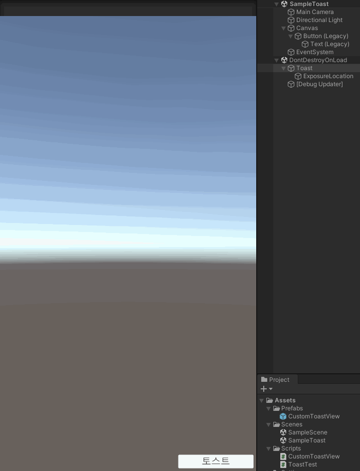

# Toast

### 소개
토스트 간단한 형태의 알림 메시지를 화면에 보여주기 위한 패키지 입니다.



### 설치방법
1. 패키지 관리자의 툴바에서 좌측 상단에 플러스 메뉴를 클릭합니다.
2. 추가 메뉴에서 Add package from git URL을 선택하면 텍스트 상자와 Add 버튼이 나타납니다.
3. https://github.com/DarkNaku/Toast.git 입력하고 Add를 클릭합니다.

### 사용방법
샘플 프로젝트를 포함하고 있으니 세부적인 구현 방법은 코드를 참고하세요.

```csharp
Toast.Show<CustomToastView>().SetMessage($"테스트 메세지 입니다.");
```

### 기능
* 토스트 메세지 노출 위치 설정
* 한번에 노출 가능한 최대 토스트 숫자 설정(나머지는 Queue 처리)
* 토스트 메시지를 클릭해서 사라지게 설정 가능
* 토스트 메시지가 중복 되는 경우 이전 메시지가 자리를 양보하도록 설정 가능